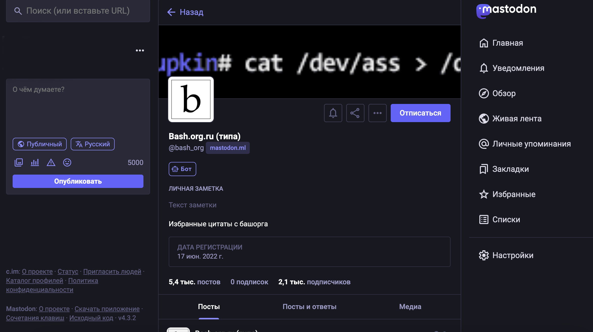

## Что такое Mastodon?

[Mastodon](https://joinmastodon.org/servers) — это децентрализованная социальная сеть, которая функционирует на основе открытого программного обеспечения. Она была создана в 2016 году немецким разработчиком Эваном Мэстером и с тех пор привлекла внимание пользователей, ищущих альтернативы традиционным платформам. Mastodon позволяет пользователям создавать свои собственные серверы (инстансы), которые могут взаимодействовать друг с другом, образуя так называемую "федерацию".

## Децентрализация
Одной из главных особенностей Mastodon является его децентрализованная структура. Это означает, что нет единого контролирующего органа или компании, которая управляет всей сетью. Каждый инстанс управляется отдельным администратором, что позволяет пользователям выбирать сервер, который соответствует их интересам и ценностям. Эта децентрализация способствует большей свободе слова и снижает риск цензуры.

## Контроль над данными
В отличие от традиционных социальных сетей, где пользовательские данные могут быть использованы для рекламы и других коммерческих целей, Mastodon предлагает пользователям больший контроль над своими данными. Пользователи могут выбирать инстансы с политиками конфиденциальности, которые им подходят, и даже создавать свои собственные правила для управления контентом.

## Сообщество и взаимодействие
Mastodon акцентирует внимание на создании сообществ. Пользователи могут находить единомышленников на своих инстансах, а также взаимодействовать с пользователями других серверов через федерацию. Это создает более интимную и поддерживающую атмосферу по сравнению с крупными централизованными платформами, где взаимодействие часто происходит в шумной и конкурентной среде.

## Отсутствие алгоритмов
Mastodon не использует алгоритмы для сортировки контента в лентах пользователей. Вместо этого пользователи видят сообщения в хронологическом порядке. Это позволяет избежать "пузырей фильтров", когда пользователи видят только ту информацию, которая соответствует их интересам, и способствует более разнообразному восприятию информации.

## Креативность и разнообразие контента
Платформа поддерживает различные форматы контента, включая текстовые посты, изображения и видео. Пользователи могут также использовать теги для организации своих публикаций и поиска интересного контента. Это создает пространство для креативности и самовыражения.

## Социальная ответственность
Mastodon привлекает внимание пользователей, которые ценят социальную ответственность и этику в цифровом пространстве. Многие инстансы имеют свои правила поведения и модерации, что помогает поддерживать здоровую атмосферу общения.

## Заключение
Mastodon представляет собой интересный эксперимент в мире социальных сетей, предлагая альтернативу централизованным платформам с акцентом на децентрализацию, контроль над данными и создание сообществ. Его подход может стать новым витком в развитии социальных сетей, особенно для тех пользователей, которые ищут более безопасные и этичные способы общения в интернете. В условиях растущего недовольства традиционными социальными сетями Mastodon имеет все шансы занять свою нишу в цифровом пространстве.