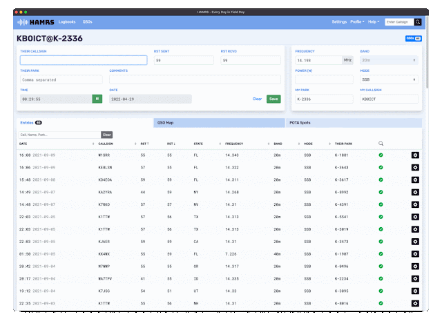

[HAMRS](https://hamrs.app) Ham Radio Multi-Mode Rig Software - эта программа, разработанная специально для радиолюбителей, которая предоставляет широкий спектр функций для ведения журнала связей.

Основные возможности программы HAMRS включают в себя:

- Управление радиостанцией: программа позволяет пользователям управлять настройками своей радиостанции, включая частоту, режим работы (CW, SSB, FM, AM и др.), мощность передатчика и другие параметры.
- Ведение журнала связей: HAMRS предоставляет удобный интерфейс для ведения журнала своих радиосвязей. Пользователи могут легко добавлять новые связи, указывать дату, время, частоту, режим работы и другие данные о каждой связи.
- Автоматическое распознавание и заполнение данных о связях: программа поддерживает автоматическое распознавание данных о связях, что упрощает процесс ведения журнала и уменьшает вероятность ошибок.
- Экспорт журнала в различные форматы: пользователи могут экспортировать свой журнал связей в различные форматы, такие как ADIF, CSV и другие, для последующего анализа и обработки данных.
- Поддержка различных операционных систем: HAMRS доступен для операционных систем Windows, macOS и Linux а так-же Android и iOS, что делает его доступным для широкого круга пользователей.
HAMRS - это удобная и мощная программа для любителей радиосвязи, которая обеспечивает широкий спектр функций для управления радиостанциями и ведения журнала связей. 