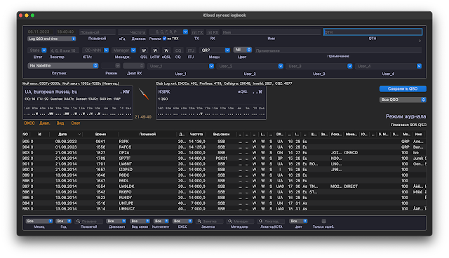

[RUMlogNG](https://www.dl2rum.de/rumsoft/RUMLog.html) - это программа для управления журналом радиолюбительских связей, разработанная для операционной системы macOS. Она предоставляет радиолюбителям инструменты для ведения подробных записей о своих связях, контактах и QSL-картах.
Основные функции программы RUMlogNG включают:

Журнал связей: Пользователи могут легко вести записи о каждой связи, включая дату, время, частоту, режим, сигнальную силу и другую информацию. Это помогает радиолюбителям отслеживать и оценивать свою активность.
QSL-карты: Программа позволяет пользователям управлять своими QSL-картами и запросами, отмечать получение и отправку карточек, а также вести записи о специальных QSL-картах.
Интеграция с кластером: RUMlogNG может подключаться к радиолюбительским кластерам для получения информации о текущих связях и условиях работы на различных частотах. Это помогает пользователям находить новые станции и управлять своей активностью.
Расчеты и статистика: Программа предоставляет различные расчеты и статистические данные, такие как количество связей по странам, штатам или иным географическим областям. Это помогает радиолюбителям отслеживать свой прогресс и достижения.
Интеграция с другими программами: RUMlogNG может импортировать и экспортировать данные из других программ для удобного обмена информацией и совместной работы.
В целом, RUMlogNG - это мощный инструмент для радиолюбителей, который помогает им эффективно вести записи о своих связях, управлять QSL-картами и анализировать свою активность. Она предлагает множество функций, которые делают ее полезной и удобной для всех радиолюбителей.