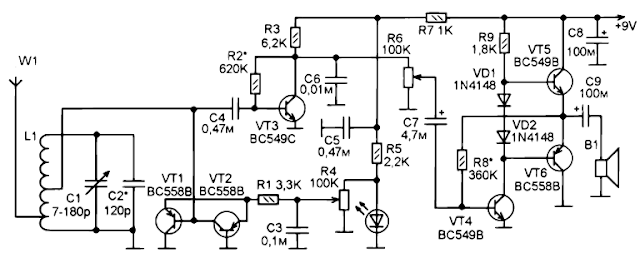

Проблема приемника прямого усиления, особенно на КВ в очень низкой селективности по соседнему каналу. В основном это результат низкой добротности входного контура.

Из-за этого прием на КВ практически не возможен из-за близкого расположения станций и малой, относительно ширине диапазона, их полосы. Проблема решается в супергетеродинной схеме путем переноса принимаемых сигналов на одну промежуточную частоту и фильтрации через многозвенный фильтр в тракте УПЧ. В приемнике прямого усиления обычно используют вариант с многоконтурным входным фильтром, перестраиваемым по диапазону. Оба варианта сложны. Вариант супергетеродинный более жизнеспособен так как относительно легче в налаживании. Вариант прямого усиления с многозвенным входным контуром очень сложен в налаживании, в частности в сопряжении контуров.

Но есть и весьма простой способ — поднять добротность единственного контура с помощью умножителя добротности. В схеме на рисунке на транзисторах VT1 и VT2 собран каскад, повышающий добротность входного контура. Практически это двухкаскадный усилитель с очень большой положительной обратной связью, в результате действия которой входное сопротивление усилителя становится отрицательным. Это отрицательное сопротивление через отвод приложено к контурной катушке, и снижает сопротивление контура повышая таким образом его добротность, в теории, до величин стремящихся к бесконечности. Однако здесь возникает опасность генерации, поэтому при работе с приемником необходимо регулировать эффективность этого каскада, в данном случае, изменяя на нем напряжение питания.

Теперь ближе к схеме. Входной сигнал принимается антенной W1 и поступает на входной контур L1C1C2. Участок КВ диапазона, сигналы в котором предполагается принимать зависит от числа витков этой катушки и емкости добавочного конденсатора С2. Настройка на станцию в пределах диапазона осуществляется переменным конденсатором С1. Антенна подключена к нижнему отводу катушки. Сигнал снимается с другого отвода с большей части витков. Далее, не считая схемы на транзисторах VT1 и VT2, сигнал поступает на усилитель-амплитудный детектор на транзисторе VT3. В качестве детектора работает коллекторный переход транзистора.

Схема увеличения добротности контура выполнена на транзисторах VT1 и VT2. Питание на них поступает через резистор R1 от переменного резистора R4. Напряжение стабилизировано на уровне 1,8V с помощью параметрического стабилизатора на светодиоде HL1 и резисторе R5. Величина напряжения, поступающего для питания каскада на транзисторах VT1 и VT2 регулируется при помощи переменного резистора R4.

Демодулированный сигнал с коллектора VT3 поступает на усилитель НЧ через регулятор громкости на переменном резисторе R6.

УНЧ двухкаскадный на транзисторах VT4-VT6 с двухтактным выходным каскадом на VT5 и VT6. Выход — на миниатюрный динамик от карманного приемника (мощность до 0.25W, сопротивление 8-50 Ом).

Катушка контура сделана на стержне от магнитной антенны карманного приемника. Стержень диаметром 8 мм и длиной от 60мм и более. Каркас в виде бумажной гильзы, склеенной из ватмана. Число витков катушки 20, намотка проводом ПЭВ 0,43, первый отвод (для подключения антенны) от 5 витков, второй отвод — от 10 витков. Еще можно заранее сделать два отвода от 12 и от 15 витков, — это для регулировки в процессе налаживания.

Детали. Транзисторы n-р-n можно заменить на КТ3102, а р-n-р — на КТ3107. Светодиод обычный индикаторный красный, например, АЛ307.

Налаживание следует начинать с УНЧ. Подбором сопротивления R8 устанавливаем половину напряжения питания на эмиттерах транзисторов VT5 и VT6. Подбором сопротивления R2 устанавливают напряжение на коллекторе VT3 равное 1,5V.

При указанных здесь параметрах контура приемник должен работать примерно в диапазоне от 7 до 12 МГц. Изменить в любую сторону можно изменением числа витков катушки и емкости конденсатора С2.

Если схема умножения добротности будет работать не достаточно эффективно нужно перепаять её на другой отвод (для этого сделаны отводы от 12 и 15 витка). 

Источник: Радиоконструктор № 04 2012г.

Автор: Иванов А.