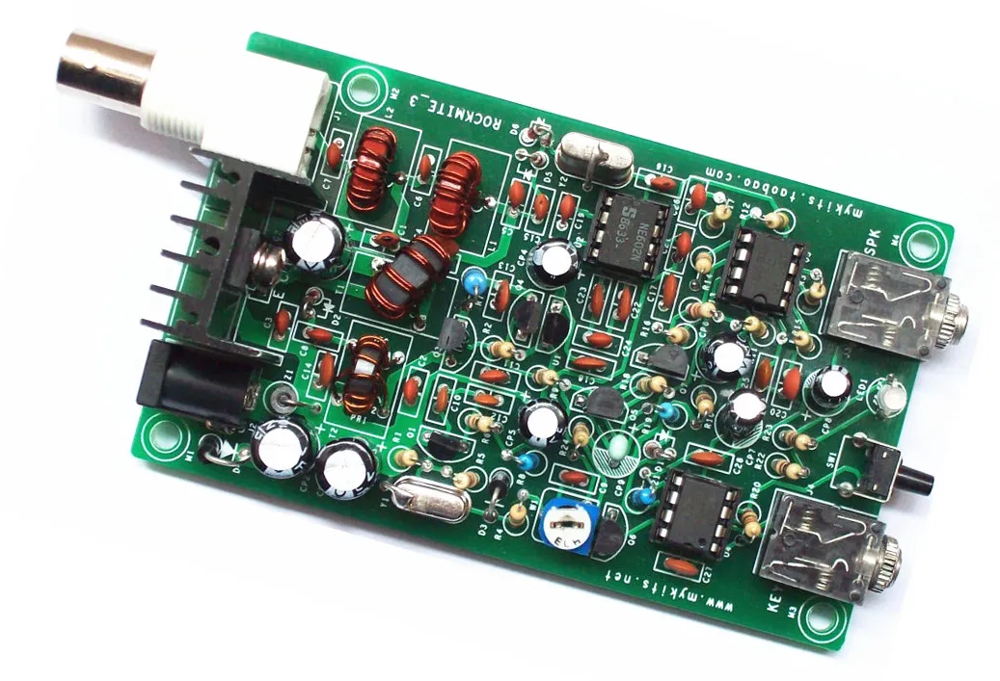

 Коротковолновые приемопередатчики остаются популярными среди радиолюбителей благодаря своей простоте, компактности и возможности самостоятельной сборке. Одним из интересных проектов в этой области является коротковолновый приемопередатчик PIC Version 8W Super RM RockMite QRP, который можно приобрести на известном китайском маркетпрейсе.

## Схема 
 RockMite QRP спроектирован так, чтобы его можно было собрать даже начинающим радиолюбителям. Схема устройства достаточно проста. Но лично я немного доработал его, добавив регулировку громкости и небольшую расстройку по частоте.

## Мощность передачи
По документации RockMite QRP предлагает выходную мощность до 8 Вт, что позволяет эффективно работать на коротких волнах. Но к сожалению фактическая выходная мощность чуть больше одного ватта.

## Частотный диапазон
Приемопередатчик работает в диапазоне 40 метров, а точнее 7023 кГц, что является одним из самых популярных диапазонов для QRP (низкомощной) радиосвязи. Это позволяет пользователям легко находить других операторов.

## Заключение
 Коротковолновый приемопередатчик PIC Version 8W Super RM RockMite QRP — это отличный выбор для радиолюбителей, которые ценят компактность, простоту и возможность доработки. Благодаря своим характеристикам и удобству использования, он подходит как для новичков, так и для опытных операторов. 