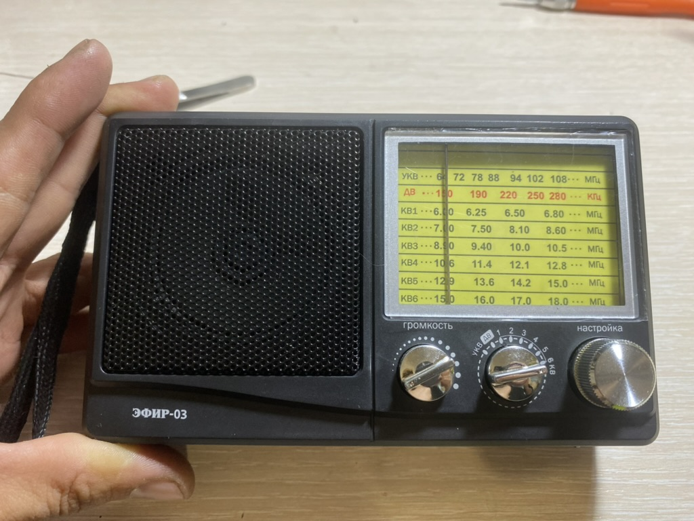

---
title: "Радиоприемник Эфир 03"
date: 2023-12-05
description: ""
tags: ["Приемник", "AM"]
type: post
weight: 20
showTableOfContents: true
image: "1B0281F3-B7CB-4714-B1D2-D658A417AF1D_1_105_c.jpeg"
--
** Технические характеристики: **
- Тип тюнера: DSB
- Диапазоны: УКВ/ДВ/КВ1-6
- Частоты для каждого диапазона: УКВ (64-108МГц) / ДВ (150-280КГц) / КВ1-6 (6,0-18МГц)
- Мощность динамиков: Φ57mm/8Ω/1W
- Питание: АА*4шт 6V
- Размер корпуса: 150х42х92мм

И так, у меня пополнение коллекции!
Очень простой и качественный DSP радиоприемник на микросхеме KT0936M, но есть проблема: при включении приемника УНЧ самовозбуждается, и лечится это заменой резистора обратной связи на меньший наминал.
