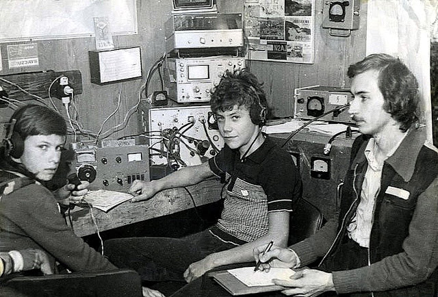

Радиолюбители – это люди, увлеченные радиоэлектроникой и радиосвязью. Они занимаются созданием, настройкой и эксплуатацией радиоаппаратуры, а также общением по радио.

Увлечение радиолюбителей началось задолго до появления современных средств связи. В то время они собирали радиоприемники и передатчики своими руками, исследовали радиоволны и устанавливали связь с другими радиолюбителями. С течением времени радиолюбительство стало доступнее широкой публике, и появились специальные организации, объединяющие радиолюбителей.

Одной из основных причин увлечения радиолюбителей является желание познавать и развивать свои навыки в области радиоэлектроники. Радиолюбители изучают принципы работы радиоаппаратуры, осваивают различные технологии и методы передачи информации. Они также участвуют в различных соревнованиях и экспедициях, где могут продемонстрировать свои навыки и получить новый опыт.

Радиолюбители также играют важную роль в обществе. В кризисных ситуациях, когда обычные средства связи могут быть недоступны, радиолюбители могут предоставить связь и помощь. Они также активно участвуют в научных исследованиях, проводят эксперименты и разрабатывают новые технологии.

Если вы заинтересовались радиолюбительством, вы можете присоединиться к местной радиолюбительской организации или начать изучать радиоэлектронику самостоятельно. Существует множество ресурсов, книг и онлайн-курсов, которые помогут вам освоить основы радиоэлектроники и научиться работать с радиоаппаратурой.

Радиолюбительство – это увлекательное и полезное хобби, которое может стать не только источником удовольствия, но и открыть новые возможности для общения, развития и помощи другим людям.

Текст написан ChatGPT gpt-3.5-turbo
