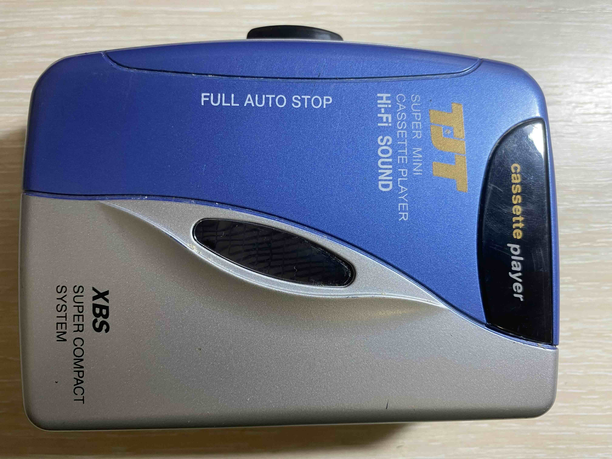
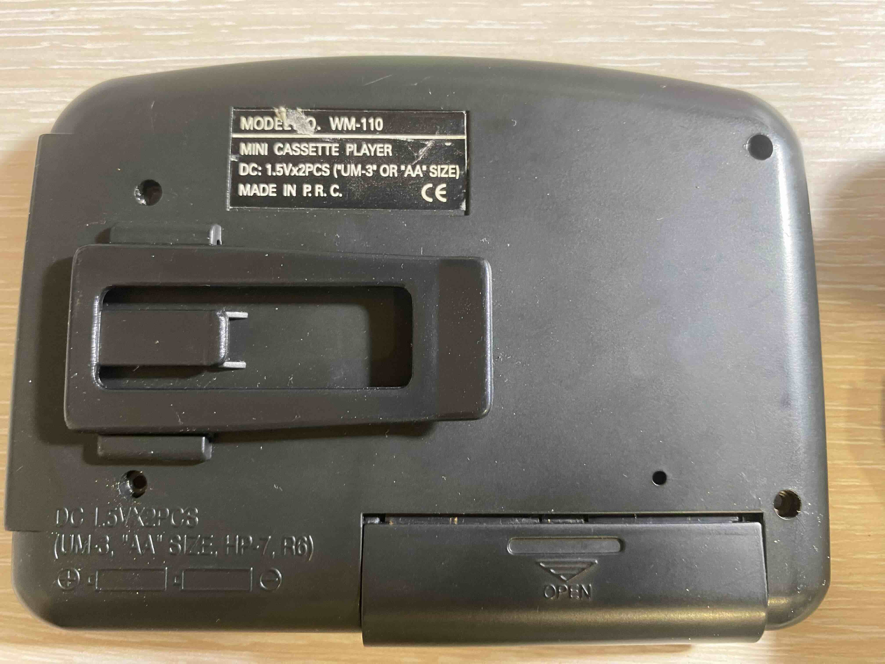
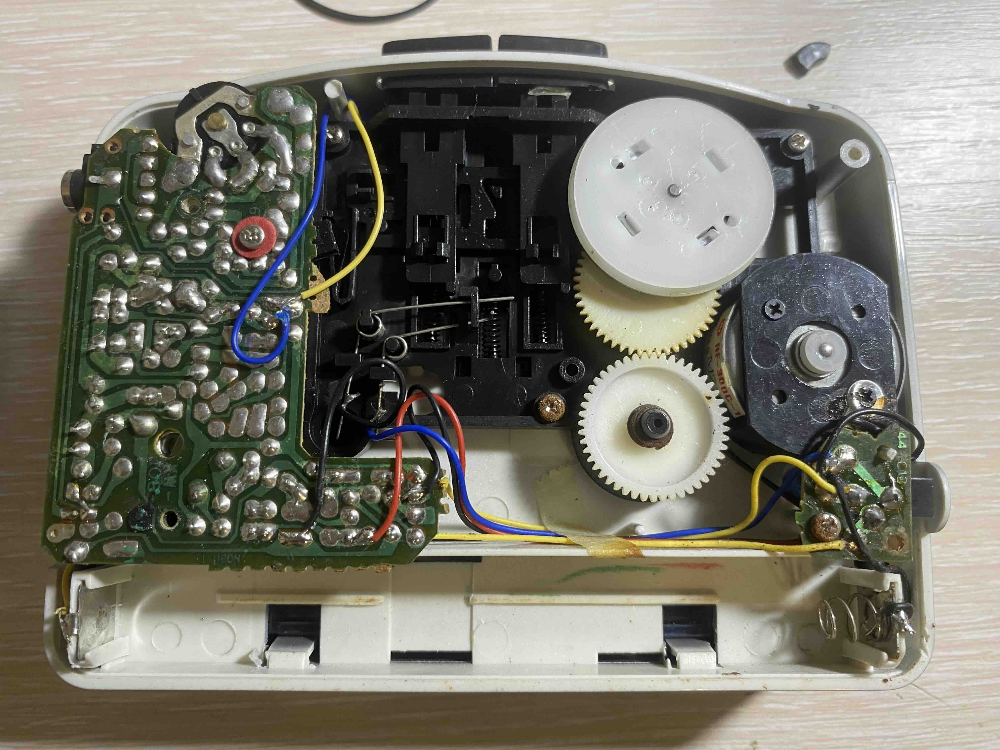
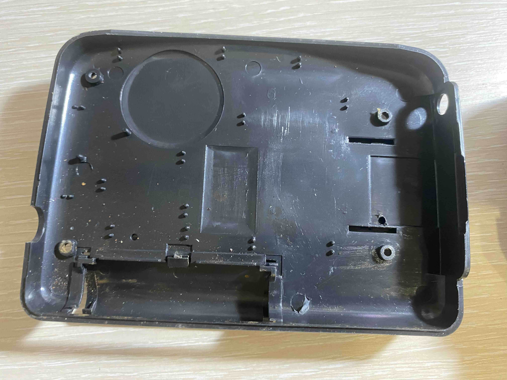

## Дизайн и конструкция

TJT WM-110 имеет классический дизайн, характерный для кассетных плееров 90-х и 2000-х годов. Устройство выполнено в компактном формате, что позволяет легко помещать его в карман или сумку. Корпус плеера выполнен из качественного пластика, что обеспечивает легкость и долговечность. Простые линии и минималистичный подход к дизайну делают его универсальным аксессуаром.

Все кнопки интуитивно понятны и легко доступны, что позволяет пользователю быстро освоиться с управлением.

## Функциональность

Хотя TJT WM-110 является монофоническим плеером, он все же способен воспроизводить звук с очень среднем качеством для кассетного устройства. 
Устройство работает от обычных батареек, что делает его удобным для использования в поездках или на природе. Важно отметить, что отсутствие сложной электроники снижает вероятность поломок и делает его надежным спутником в любых условиях.

## Ностальгия и уникальность

Одним из главных достоинств TJT WM-110 является его способность вызывать ностальгические чувства у пользователей. Для многих людей кассетные плееры ассоциируются с молодостью, свободой и романтикой. В эпоху цифровых технологий этот плеер предлагает возможность вернуться в прошлое и заново открыть для себя музыку на кассетах.

## Заключение

TJT WM-110 — это не просто устройство для воспроизведения музыки; это настоящая машина времени, которая переносит нас в эпоху аналогового звука. Его простота, надежность и ностальгическая эстетика делают его очень привлекательным для меня как для коллекционера.